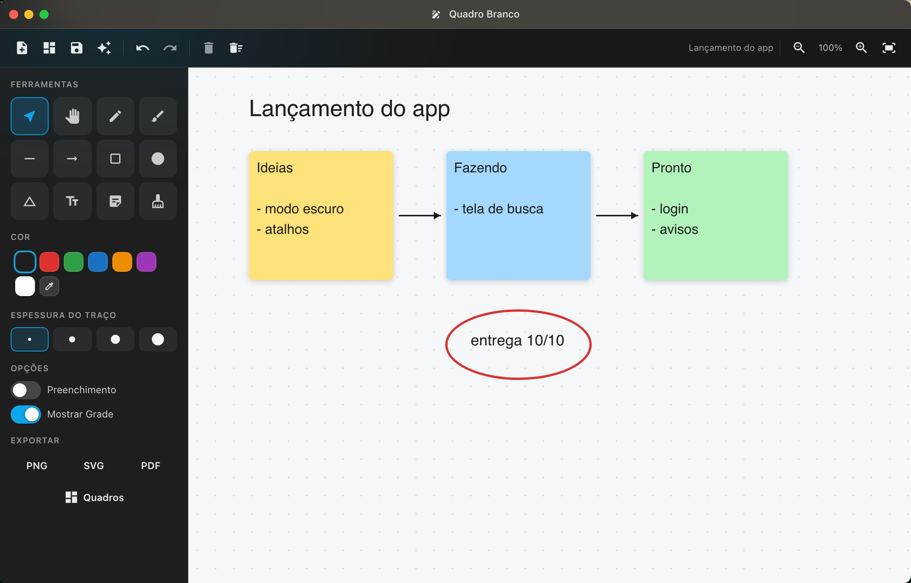
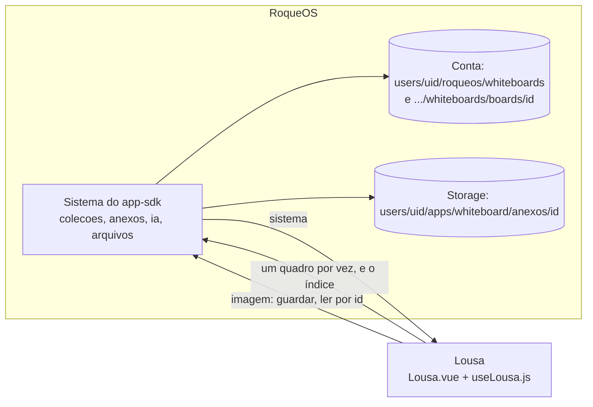

# Quadro Branco (Lousa)

O Quadro Branco do [RoqueOS](https://roqueos.com.br): um quadro infinito com retângulo, elipse,
losango, linha, seta, lápis e caneta à mão livre, texto, notas adesivas e imagens; selecionar,
mover, redimensionar e girar; desfazer e refazer; vários quadros na conta, com o último aberto
de volta; exportar em PNG, SVG e PDF; guardar o quadro como `.rosboard` nos Arquivos, e abrir
o `.rosboard` de volta com um duplo clique no Finder; e IA sobre o que está escrito (resumir, agrupar em temas, tirar as ações). Nos dez idiomas do
RoqueOS. O repositório se chama `lousa`; na tela, o app é o Quadro Branco.

Use de graça em [roqueos.com.br](https://roqueos.com.br), no computador, no celular e na TV.



_English below._

## Por que existe como repo

O Quadro Branco nasceu dentro do RoqueOS, que é fechado. Em 28/09/2026 ele foi para o próprio
repositório na organização [roqueos-apps](https://github.com/roqueos-apps), o primeiro app que
lê um documento grande de cada vez e guarda imagem como anexo. O RoqueOS o instala por uma
tag, como dependência git, e ele fala com o RoqueOS só pelo
[`app-sdk`](https://github.com/roqueos-apps/app-sdk). A tela é feita com o kit
[`ui`](https://github.com/roqueos-apps/ui). O mesmo código roda dentro do RoqueOS, sozinho no
navegador (`yarn dev`) e no teste.

## Arquitetura



```text
app.json            quem ela é: id permanente (whiteboard), nome e descrição nos dez idiomas,
                    ícone, cor, janela, as capacidades e as coleções que ela abre
i18n/<idioma>.json  os textos da tela, um arquivo por idioma
src/
  index.js          definirApp: cria o app Vue próprio dentro do elemento que o RoqueOS dá
  Lousa.vue         a tela: as barras (larga e estreita), o quadro em SVG, o editor de texto
  Ferramentas.vue   as ferramentas, as cores, a espessura, as opções e a exportação
  Quadros.vue       os quadros: abrir, criar, renomear e apagar
  useLousa.js       o motor: estado, máquina de ponteiro, histórico, salvamento, imagem
  quadros.js        os quadros na conta, pelas coleções do sistema
  elements.js       os elementos: criar, traço à mão, migração do formato antigo, texto
  geometry.js       seleção, alças, mover, redimensionar, girar, caixa de conteúdo
  history.js        desfazer e refazer
  serialize.js      o quadro em SVG
  export.js, pdf.js PNG, SVG e PDF (o PDF sem dependência: um JPEG numa página)
  textos.js         carrega o JSON do idioma (com ?raw) e traduz uma chave
  *.scss            o visual
dev/main.js         o yarn dev: a Lousa numa janela falsa do RoqueOS
test/               Vitest: o app pelo SDK, o motor, e as peças puras
```

### Como ela fala com o RoqueOS

Só pelo `sistema` do SDK, e cada capacidade opcional está no `app.json`:

- `colecoes`: `quadros`, um documento por quadro (`{ name, elements, view }`), lido **um de
  cada vez** com `ler(id)`, porque um quadro chega perto do 1 MB que o banco aceita; e
  `indice`, o documento `whiteboards` com a lista (`boards`) e o último aberto
  (`lastBoardId`). São os mesmos lugares de antes de a Lousa sair do RoqueOS: nada migrou.
- `anexos`: a imagem colada no quadro. O elemento guarda só o id (`{ type: 'image', anexo }`)
  e, ao abrir, a Lousa lê o Blob e desenha por uma URL local. O endereço do arquivo nunca
  chega aqui, a imagem não pesa no 1 MB do quadro, e ela não aparece nas Imagens do Finder: é
  do quadro. A imagem de antes, com o endereço no elemento (`src`), continua abrindo.
- `ia`: o painel de IA do RoqueOS, só de leitura, sobre o texto escrito no quadro, com duas
  ações da Lousa somadas ao catálogo: agrupar em temas e tirar as ações. A Lousa não vê agente
  nem chave.
- `arquivos`: guardar o quadro como `.rosboard` em Documentos.
- `abertura`: o `.rosboard` que o Finder manda abrir, no duplo clique ou no "abrir com". O
  `app.json` declara o tipo em `abre` (`application/vnd.roqueos.rosboard+json`, o mesmo que o
  salvar grava), e o RoqueOS reconhece o arquivo pela extensão, também o guardado antes como
  `application/json`. Com conta, o arquivo vira um quadro novo da conta, e as imagens embutidas
  viram anexo; na memória, entra no quadro aberto, e desfazer volta ao desenho de antes.
- `idioma`, `desempenho` (o perfil leve tira a malha e o desfoque), `avisar`, `metricas` (o
  evento `save`, o mesmo de antes).

Sem conta, o quadro vive na memória e a imagem entra embutida (data URL), como sempre foi. A
conta trocou com a Lousa aberta: o que esperava para gravar não vai para a conta nova, e os
quadros dela abrem.

### O que se grava, e quando

Cada mudança espera 800 ms e grava o quadro aberto inteiro (o nome, os elementos e a vista).
Acima de 900 KB, os traços à mão livre longos perdem três de cada quatro pontos, e a Lousa
avisa; se nem assim couber, ela avisa e não grava. O teste `lousa.spec.js` confere o que vai
para a conta, e quando não vai.

## Pré-requisitos

- Node 22 ou mais novo (o `.nvmrc` diz 24).
- Yarn 1.22.

## Como rodar

```bash
yarn install --ignore-scripts
yarn dev          # a Lousa numa janela falsa do RoqueOS, numa conta local
yarn verificar    # lint, formato, testes e app check: o mesmo do CI e do pre-push
yarn test         # só os testes
```

Na janela do `yarn dev` os quadros ficam no `localStorage` e continuam depois do F5; as imagens
ficam em memória e somem no F5. A janela é redimensionável: abaixo de 700 px de largura a Lousa
vira a de celular (barra curta, ferramentas na folha). `?idioma=ar-AR` abre em árabe,
`?leve=1` como o aparelho fraco vê, `?convidado=1` sem conta. O painel de IA aparece como um
aviso no lugar onde o do RoqueOS abriria, com os rótulos das ações da Lousa.

## Paridade com o app de antes

`paridade.json` é o inventário do que o Quadro Branco fazia dentro do RoqueOS e do que aconteceu com
cada coisa na saída: `mantida`, `mudou` (com a nota do que mudou) ou `perdida` (só com a
decisão escrita de quem decidiu). Cada item cita o teste deste repo que o prova, ou a
evidência. O RoqueOS confere o arquivo no pacote instalado antes de aceitar a versão: teste
citado que não existe mais, estado de dúvida ou perda sem decisão reprovam. Mudou uma
funcionalidade, ou um teste citado ali? Atualize o inventário no mesmo commit.

## Contribuir

Leia o [CONTRIBUTING.md](CONTRIBUTING.md). Todo commit leva `Signed-off-by` (DCO), e o CI
confere. Falha de segurança vai pelo [SECURITY.md](SECURITY.md), nunca por issue pública.

## Créditos e licença

[MIT](LICENSE). Os ícones são do [Material Icons](https://fonts.google.com/icons)
(Apache-2.0), pelo kit de interface; veja o [ASSETS.md](ASSETS.md). O nome e a marca RoqueOS
são da LEVELHARD e não fazem parte da licença.

---

## English

The Whiteboard app of [RoqueOS](https://roqueos.com.br): an infinite board with shapes, lines,
arrows, freehand pencil and pen, text, sticky notes and images; select, move, resize and
rotate; undo and redo; several boards in the user's account; export as PNG, SVG and PDF; save
the board as `.rosboard` to Files, and open a `.rosboard` back with a double click in Finder;
and AI over what is written (summarize, group into themes,
extract action items). In all ten RoqueOS languages. The repository is called `lousa`; the app
is shown as Whiteboard.

It moved out of the closed RoqueOS core on 28/09/2026 into its own repository in the
[roqueos-apps](https://github.com/roqueos-apps) organization. RoqueOS installs it by tag, and it
talks to RoqueOS only through the `sistema` of
[`@roqueos-apps/app-sdk`](https://github.com/roqueos-apps/app-sdk): `colecoes` (one document
per board, read one at a time, plus the board index, in the same places as before), `anexos`
(pasted images kept by a durable id that never becomes a URL), `ia` (the system's read-only AI
panel with two whiteboard actions added; no agent or key reaches the app), `arquivos` (save as
`.rosboard` to Documents), `abertura` (the `.rosboard` Finder hands over on a double click or
"open with": a new board in the account, embedded images become attachments), plus language,
light profile, notices and metrics. Guests keep the
board in memory with images embedded.

Run `yarn install --ignore-scripts`, then `yarn dev` (a fake RoqueOS window with a local
account) or `yarn verificar` (what CI runs). Every commit must be signed off (DCO). Licensed
under [MIT](LICENSE); icons are Material Icons (Apache-2.0). The RoqueOS name and brand belong
to LEVELHARD and are not covered.

`paridade.json` lists everything this app did inside the RoqueOS core and what happened to each
item when it moved out (kept, changed with a note, or lost only with a written decision), each
backed by a test in this repository or other evidence. RoqueOS checks it in the installed
package before accepting a version.
